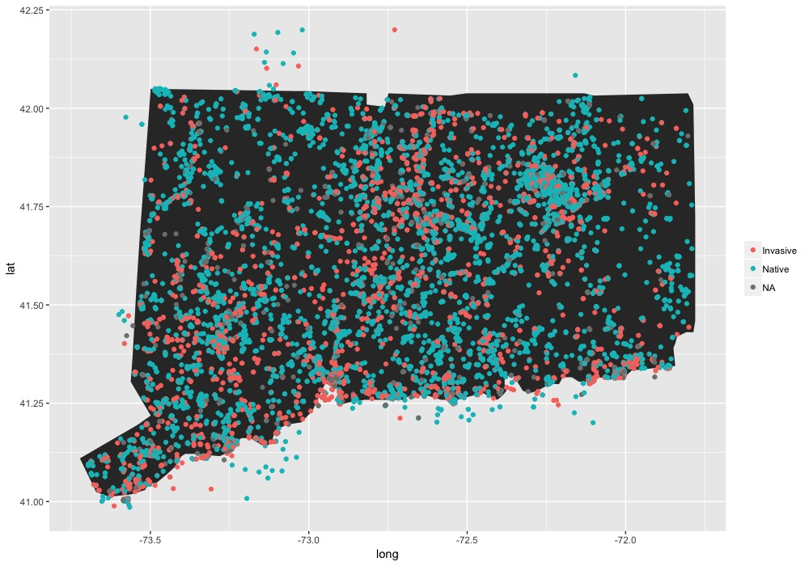

# All Plant iNaturalist Observations for Connecticut
Steven DiFalco- 9/5/2019

This document shows how iNaturalist data can be used and some simple code to create map outputs. The data here is all plant observations for the state of Connecticut between 2008-2018, obtained from the iNaturalist website (https://www.inaturalist.org/observations/export). 

Only research grade, non-cultivated, observations were exported. Some of the code in the following example are borrowed from another tutorial using iNaturalist data (https://github.com/micahfreedman/monarch_map_gif)

For complete [code](https://github.com/stevendifalco/iNaturalist_Data/blob/master/iNat_allPlantCT.Rmd) 

Packages used
`library(plyr); library(ggplot2); library(tidyverse)`

I was interested to identify whether species observed were invasive or native. To do that, I downloaded a vascular plant list with that information, extracted 'origin' category, and combined this with the inat observations. [Plant list](https://sites.google.com/a/conncoll.edu/vascular-plants-of-connecticut-checklist/)

Using the above information, I created a map of where observations were invasive or native species

  
Knowing which species were most observed

